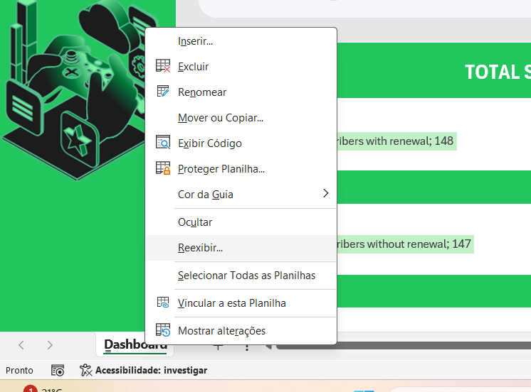

# Dashboard de Vendas do Xbox

                     

## Sobre o Projeto
Este projeto foi desenvolvido como parte do desafio do curso **"Criando um Dashboard de Vendas do Xbox"**, promovido pela **Digital Innovation One (DIO)** em parceria com a **Heineken**, sob a orientação do Tech Educator **Felipe Aguiar** ([LinkedIn](https://www.linkedin.com/in/felipeaguiar-exe)). O objetivo foi criar um **dashboard interativo no Excel** para visualizar e analisar as assinaturas do **Xbox Game Pass**, **EA Play** e **Minecraft Season Pass**.

## Objetivo do Desafio
O desafio proposto consistia na criação de um **dashboard de vendas**, com foco na organização e visualização de dados, permitindo uma análise eficaz do desempenho de vendas e auxiliando na tomada de decisões baseadas em dados.

## Tecnologias Utilizadas
- **Microsoft Excel**: Ferramenta principal para a criação do dashboard e análise de dados.
- **Power Query**: Utilizado para transformar e organizar os dados de forma eficiente.
- **Gráficos e Tabelas Dinâmicas**: Para facilitar a visualização das informações.

## Estrutura do Dashboard
O dashboard criado apresenta os seguintes elementos:
- **Quantidade de Assinaturas do EA Play Season Pass**.
- **Receita gerada pelo Minecraft Season Pass**.
- **Análise de assinantes do Xbox Game Pass**, segmentados por renovação de assinatura.
- **Filtros interativos**, permitindo a seleção de assinaturas anuais, mensais ou trimestrais.

## Experiência de Desenvolvimento
Durante o desenvolvimento deste projeto, pude aprimorar minhas habilidades em **análise de dados**, **visualização de informações** e **manipulação de dados no Excel**. A experiência foi enriquecedora, pois reforçou a importância de transformar **dados brutos** em **insights estratégicos**.

## Como Reproduzir
1. Baixe o arquivo **Excel (.xlsx)** disponível neste repositório.
2. Abra o arquivo no Microsoft Excel.
3. Na aba das planilhas clique com o botão direito do mouse e clique em reexibir

----

---- 

4. Utilize os filtros interativos para explorar os dados e visualizar os insights.

## Conecte-se Comigo
Caso queira trocar experiências ou saber mais sobre o projeto, entre em contato:
- **Robson Pereira Lago** - [LinkedIn](https://www.linkedin.com/in/rp-lago)
- **DIO Bootcamp** - [Coding the Future Heineken - IA para Análise de Dados](https://www.dio.me/bootcamp/coding-the-future-heineken-ia-para-analise-de-dados)

Agradeço à DIO e à Heineken pela oportunidade de aprendizado e ao **Felipe Aguiar** pela excelente orientação no curso!

